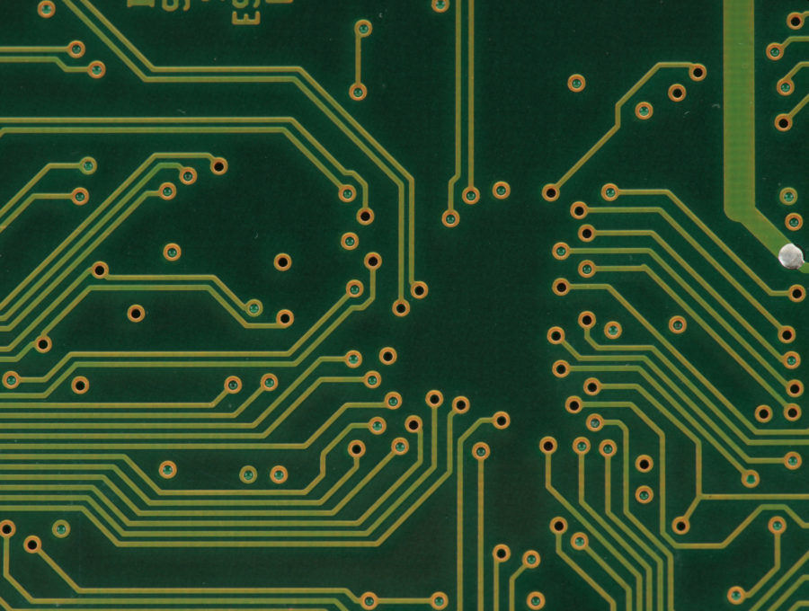
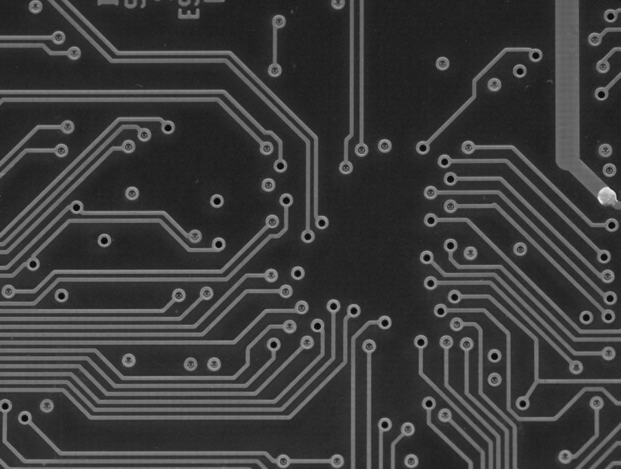
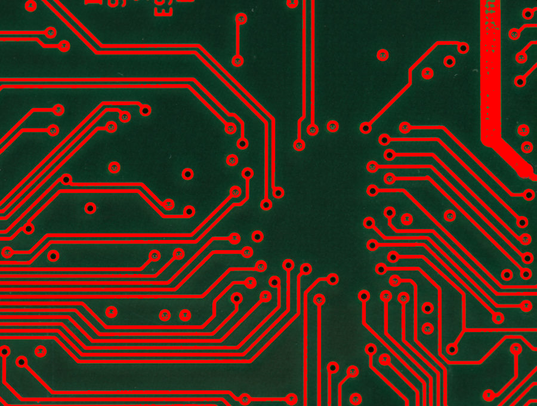

ps1-2

Shaobo Wang

Terminal printout:


```
python ps1_2.py circuit.png B
python ps1_2.py crack.png D
```


Image output:






File list in the ps1-2 folder:


Python script:

```python
import cv2
import sys
import numpy as np

MAXVALUE = 255
RED = (0, 0, MAXVALUE)  # BGR color red


#  insert string before
def insert_name(name, str2add):
    dot_idx = name.find(".")
    new_name = name[:dot_idx] + str2add + name[dot_idx:]
    return new_name


if __name__ == '__main__':
    # get input arguments
    args = sys.argv
    assert (len(args) == 3)  # make sure two arguments input
    img_name = args[1]  # input image path
    if args[2] == "B" or args[2] == "b":
        emp_bright = True  # emphasize brighter
    elif args[2] == "D" or args[2] == "d":
        emp_bright = False
    else:
        sys.exit("Wrong input arguments.")

    # read original image
    img = cv2.imread(img_name)
    if img is None:
        sys.exit("Could not read the image.")
    cv2.imshow(img_name, img)

    # convert image to gray scale
    img_gray = cv2.cvtColor(img, cv2.COLOR_BGR2GRAY)
    img_gray_name = insert_name(img_name, "_grayscale")
    cv2.imshow(img_gray_name, img_gray)  # display image
    cv2.imwrite(img_gray_name, img_gray)  # save image

    #  convert image to binary
    thresh = (np.average(img_gray) + MAXVALUE / 2) / 2  # calculate appropriate threshold
    if emp_bright:
        # emphasize part in white
        _, img_bin = cv2.threshold(img_gray, thresh, MAXVALUE, cv2.THRESH_BINARY)  
    else:
        # emphasize part in black
        _, img_bin = cv2.threshold(img_gray, thresh, MAXVALUE, cv2.THRESH_BINARY_INV)
    img_bin_name = insert_name(img_name, "_binary")
    cv2.imshow(img_bin_name, img_bin)
    cv2.imwrite(img_bin_name, img_bin)

    # convert image to output
    img_output = img.copy()
    img_output[img_bin == MAXVALUE] = RED  # white part of binary in red
    img_output_name = insert_name(img_name, "_output")
    cv2.imshow(img_output_name, img_output)
    cv2.imwrite(img_output_name, img_output)

    cv2.waitKey(0)
    cv2.destroyAllWindows()
 

```

