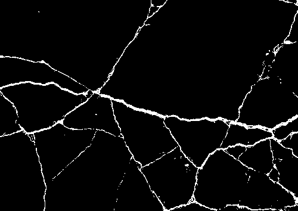
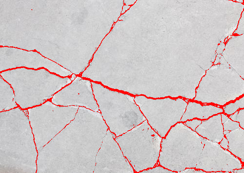

# shaobow-ps1-report

Shaobo Wang

## ps1-2 

Terminal printout:


```
python ps1_2.py circuit.png B
python ps1_2.py crack.png D
```

Image output:

  

  


  

  


File list in the ps1-2 folder:


Python script:

```python
import cv2
import sys
import numpy as np

MAXVALUE = 255
RED = (0, 0, MAXVALUE)  # BGR color red


#  insert string before
def insert_name(name, str2add):
    dot_idx = name.find(".")
    new_name = name[:dot_idx] + str2add + name[dot_idx:]
    return new_name


if __name__ == '__main__':
    # get input arguments
    args = sys.argv
    assert (len(args) == 3)  # make sure two arguments input
    img_name = args[1]  # input image path
    if args[2] == "B" or args[2] == "b":
        emp_bright = True  # emphasize brighter
    elif args[2] == "D" or args[2] == "d":
        emp_bright = False
    else:
        sys.exit("Wrong input arguments.")

    # read original image
    img = cv2.imread(img_name)
    if img is None:
        sys.exit("Could not read the image.")
    cv2.imshow(img_name, img)

    # convert image to gray scale
    img_gray = cv2.cvtColor(img, cv2.COLOR_BGR2GRAY)
    img_gray_name = insert_name(img_name, "_grayscale")
    cv2.imshow(img_gray_name, img_gray)  # display image
    cv2.imwrite(img_gray_name, img_gray)  # save image

    #  convert image to binary
    thresh = (np.average(img_gray) + MAXVALUE / 2) / 2  # calculate appropriate threshold
    if emp_bright:
        # emphasize part in white
        _, img_bin = cv2.threshold(img_gray, thresh, MAXVALUE, cv2.THRESH_BINARY)  
    else:
        # emphasize part in black
        _, img_bin = cv2.threshold(img_gray, thresh, MAXVALUE, cv2.THRESH_BINARY_INV)
    img_bin_name = insert_name(img_name, "_binary")
    cv2.imshow(img_bin_name, img_bin)
    cv2.imwrite(img_bin_name, img_bin)

    # convert image to output
    img_output = img.copy()
    img_output[img_bin == MAXVALUE] = RED  # white part of binary in red
    img_output_name = insert_name(img_name, "_output")
    cv2.imshow(img_output_name, img_output)
    cv2.imwrite(img_output_name, img_output)

    cv2.waitKey(0)
    cv2.destroyAllWindows()
 

```


## ps1-3

Terminal printout:


```
python ps1_3.py smiley.jpg
python ps1_3.py carnival.jpg
```


Image output:

  


File list in the ps1-2 folder:


Python script:

```python
import cv2
import sys
import numpy as np

MAXVALUE = 255
K = 100  # scale factor for trackbar
gamma = 1.0  # init gamma value
GAMMA_MAX = int(6 * K)  # max gamma value 4.0

win_original_name = "Original Image"
win_corrected_name = "Gamma-corrected Image"


#  insert string before
def insert_name(name, str2add):
    dot_idx = name.find(".")
    new_name = name[:dot_idx] + str2add + name[dot_idx:]
    return new_name


#  gamma correction
def gamma_correct(img_in, gm):
    lut = np.zeros((1, MAXVALUE+1), dtype=np.uint8)  # init look-up table
    for i in range(256):
        lut[0, i] = np.clip(pow(i/MAXVALUE, gamma)*MAXVALUE, 0, MAXVALUE)
    img_out = cv2.LUT(img_in, lut)  # look-up table transform
    return img_out


#  trackbar helper function
def on_gamma_trackbar(val):
    global gamma
    gamma = val/K
    cv2.setTrackbarPos("Gamma", win_corrected_name, int(gamma*K))


if __name__ == "__main__":
    # get input arguments
    args = sys.argv
    assert (len(args) == 2)  # make sure two arguments input
    img_name = args[1]  # input image path

    cv2.namedWindow(win_original_name)
    cv2.namedWindow(win_corrected_name)

    # read original image
    img = cv2.imread(img_name)
    if img is None:
        sys.exit("Could not read the image.")
    cv2.imshow(win_original_name, img)

    gamma_init = int(gamma*K)  # init position in trackbar
    cv2.createTrackbar("Gamma", win_corrected_name, gamma_init, GAMMA_MAX, on_gamma_trackbar)

    print("Press 'S' to save and exit")
    while True:
        # gamma correct image wrt trackbar val
        img_output = gamma_correct(img, gamma)
        cv2.imshow(win_corrected_name, img_output)

        key = cv2.waitKey(30)  # wait 30ms

        if key == ord("s"):
            #  press 'S' to save
            img_output_name = insert_name(img_name, "_gcorrected")
            cv2.imwrite(img_output_name, img_output)
            print("Adjusted gamma value is: " + str(gamma))
            break
        elif key == ord("q") or key == ord("x") or key == 27:
            # press 'q', 'x', 'ESC' to quit
            break

    cv2.destroyAllWindows()

```

