PS3  

Shaobo Wang


PS3-1 Image improvement via area-to-pixel filters

Screenshots of all the files in the “ps3-1” folder:


Terminal printouts:


Terminal commands:

```
>> python ps3_1.py golf.png
>> python ps3_1.py pcb.png
>> python ps3_1.py pots.png
>> python ps3_1.py rainbow.png
```

Output images:

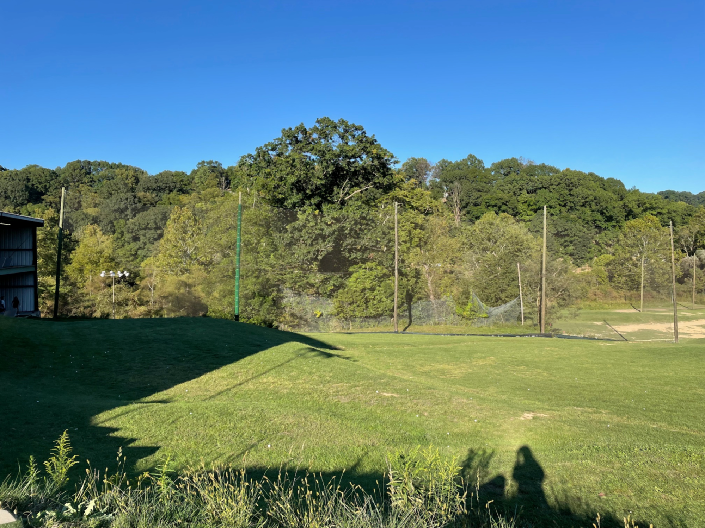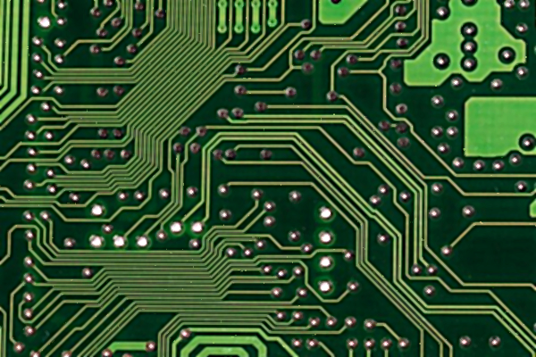 

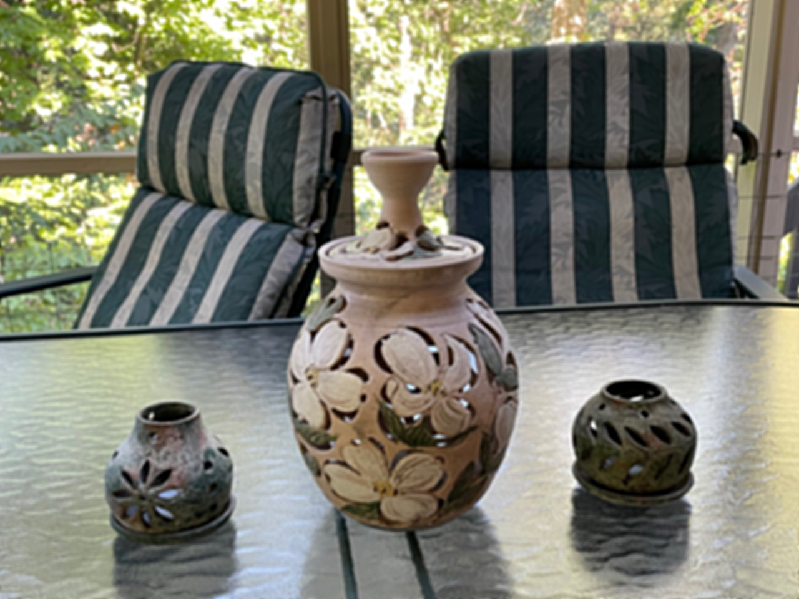 


Comments:

For "white-dot" noise in "golf.png" and "pcb.png", it is most applicable to use a median filter to eliminate those noise. Those white dots have a maximum intensity value but should not be involved in the final output at all. A median filter will not allow any contribution of those max values unless they are the median number. 

The unsharp method introduces less noise than the sharpen kernel by using a larger Gaussian filter kernel size.  

The bilateral filter preserves the edge of clouds in "rainbow.png" while efficiently removing those high-frequency noises. 


Source code:

Operating system: Windows 10
IDE: PyCharm

```python
import cv2
import sys
import numpy as np

MAXVALUE = 255

win_original_name = "Original Image"
win_improved_name = "Improved Image"


#  insert string before
def insert_name(name, str2add):
    dot_idx = name.find(".")
    new_name = name[:dot_idx] + str2add + name[dot_idx:]
    return new_name


# #  image sharpening
# def sharpen(img_in, hor_vert=False):
#     if hor_vert:
#         kernel = np.array([[0, -1, 0], [-1, 5, -1], [0, -1, 0]])
#     else:
#         kernel = np.array([[-1, -1, -1], [-1, 9, -1], [-1, -1, -1]])
#     img_out = cv2.filter2D(img_in, -1, kernel)  # negative to be same depth as input
#     return img_out


#  unsharp image sharpening
def unsharp(img_in):
    smoothed = cv2.GaussianBlur(img_in, (9, 9), 3)  # gaussian blur mask kernel size 9x9 standard div 3
    img_out = cv2.addWeighted(img_in, 2.5, smoothed, -1.5, 0)  # 2.5f1-1.5f2
    return img_out


if __name__ == "__main__":
    # get input arguments
    args = sys.argv
    assert (len(args) == 2)  # make sure two arguments input
    img_name = args[1]  # input image path

    cv2.namedWindow(win_original_name)
    cv2.namedWindow(win_improved_name)

    # read original image
    img = cv2.imread(img_name)
    if img is None:
        sys.exit("Could not read the image.")
    cv2.imshow(win_original_name, img)

    # hardcode image process for known examples
    if img_name == "golf.png":
        img_output = cv2.medianBlur(img, 3)  # median filter
    elif img_name == "pots.png":
        img_output = unsharp(img)  # unsharp sharpen
    elif img_name == "rainbow.png":
        img_output = cv2.bilateralFilter(img, 15, 80, 80)  # bilateral filter
    elif img_name == "pcb.png":
        img_output = cv2.medianBlur(img, 3)  # first median filter
        img_output = unsharp(img_output)  # then unsharp sharpen
    else:
        print("Adjust manually")
        img_output = img  # manually adjust later if unknown

    print("Press 'S' to save and exit")
    while True:
        key = cv2.waitKey(30)  # wait 30ms
        cv2.imshow(win_improved_name, img_output)

        if key == ord("s"):
            #  press 'S' to save
            img_output_name = insert_name(img_name, "-improved")
            cv2.imwrite(img_output_name, img_output)
            break

        # manually adjust
        elif key == ord("z"):
            #  press 'z' to restore origin img
            img_output = img

        elif key == ord("u"):
            #  press 'u' to use unsharp
            img_output = unsharp(img_output)

        elif key == ord("m"):
            #  press 'm' to use median filter
            img_output = cv2.medianBlur(img_output, 3)

        elif key == ord("g"):
            #  press 'g' to use gaussian filter
            img_output = cv2.GaussianBlur(img_output, (5, 5), 0)  # kernel size 5x5 standard div 0

        elif key == ord("b"):
            #  press 'b' to use bilateral filter

            img_output = cv2.bilateralFilter(img_output, -1, 0, 50)  # less color merge and large space merge

        elif key == ord("q") or key == ord("x") or key == 27:
            # press 'q', 'x', 'ESC' to quit
            break

    cv2.destroyAllWindows()
```


PS3-2 Edge detection

Screenshots of all the files in the “ps3-2” folder:


Terminal printouts: 


The parameters used in the Canny edge detector:

|               | Threshold 1 | Threshold 2 | Aperture | L2gradient |
| ------------- | ----------- | ----------- | -------- | ---------- |
| cheerios.png  | 150         | 255         | 3        | True       |
| professor.png | 85          | 100         | 3        | True       |
| gear.png      | 70          | 125         | 3        | True       |
| circuit.png   | 45          | 120         | 3        | True       |

Terminal commands:

```
>> python ps3_2.py cheerios.png s
>> python ps3_2.py professor.png s
>> python ps3_2.py gear.png s
>> python ps3_2.py circuit.png s

>> python ps3_2.py cheerios.png c
>> python ps3_2.py professor.png c
>> python ps3_2.py gear.png c
>> python ps3_2.py circuit.png c
```


Output images:

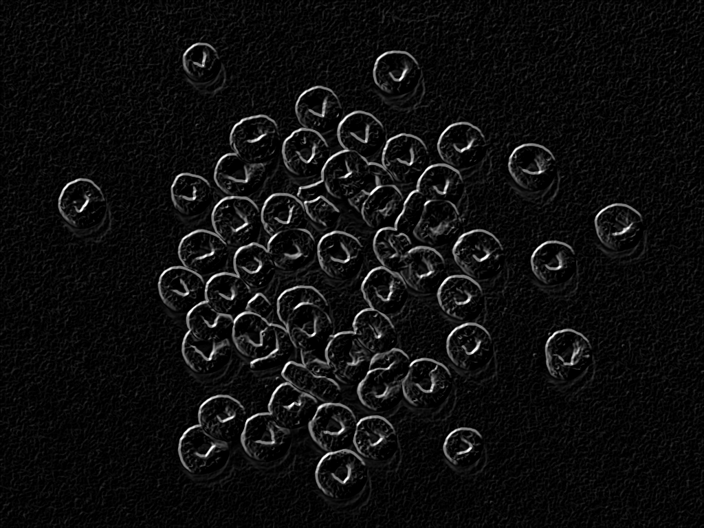  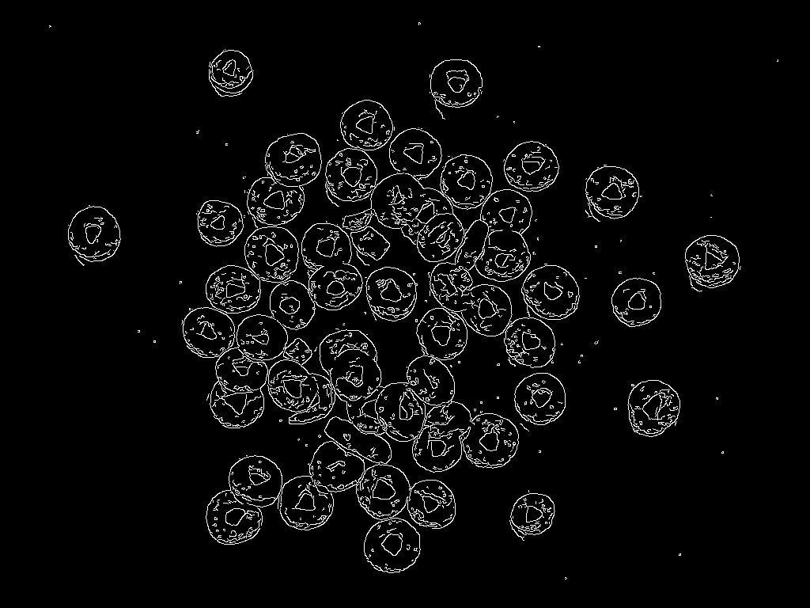 

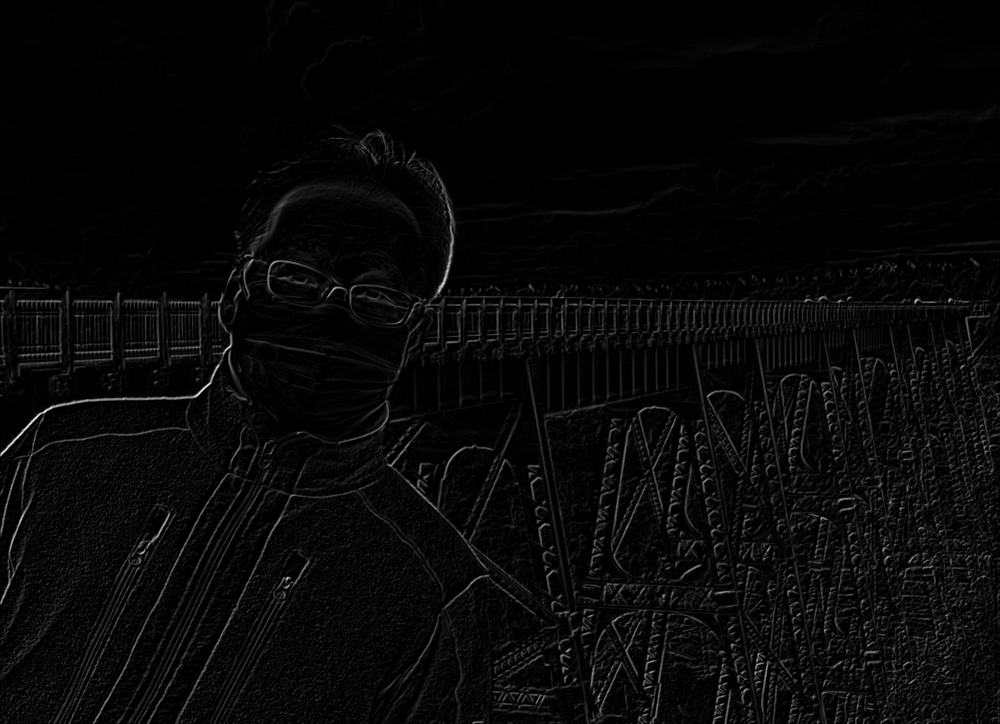  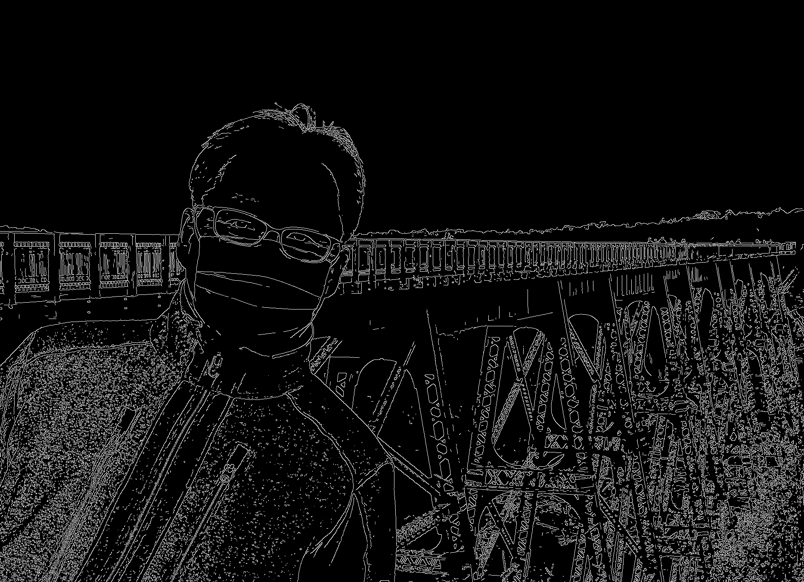 

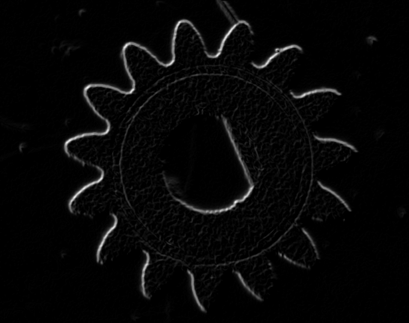 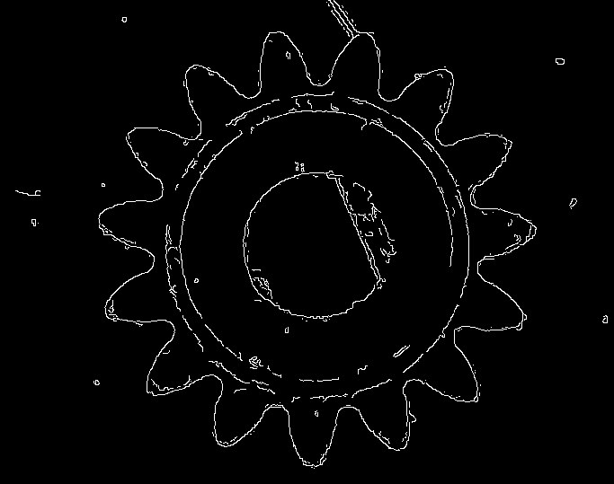 

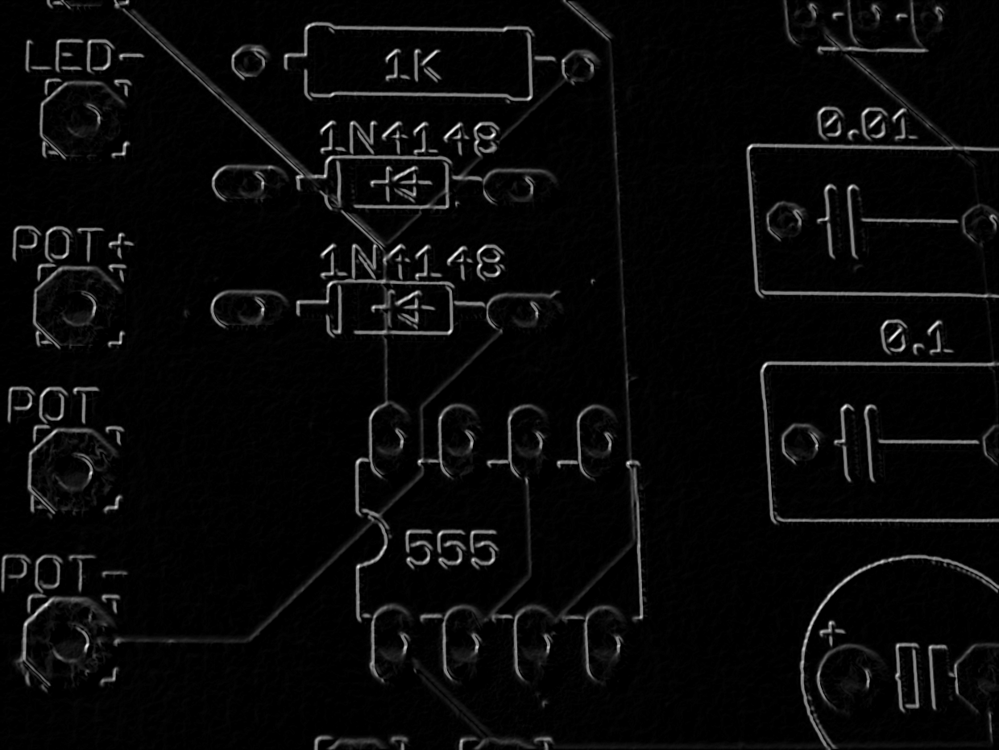 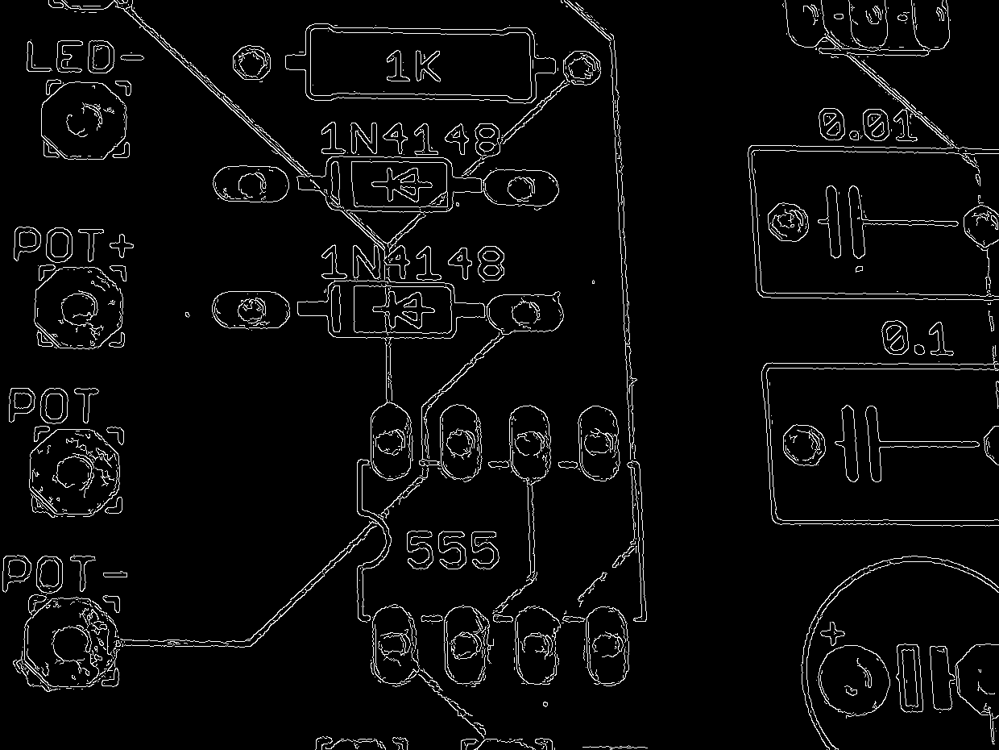 


Comments:

As shown in the images above, on the left-hand sides are Sobel filtered images, on the right-hand sides are Canny edge detected images. The Sobel filtered images emphasize the edge of images, but you can still observe high-frequency patterns in the backgrounds. On the other hand, the Canny edge detector detected the edges when the photos had precise edges. 

One thing about tuning the Canny edge detector is that I do not have clear criteria for what image should be good. Also, is it possible to apply filters to eliminate noise after edge detections? 


Source code:

Operating system: Windows 10
IDE: PyCharm 

```python
import cv2
import sys
import numpy as np

MAXVALUE = 255
thresh1 = 100  # init threshold value
thresh2 = 200
aperture = 3
l2grad = False
THRESH_MAX = MAXVALUE  # max gamma value
APERTURE_MAX = 7
APERTURE_MIN = 3

win_original_name = "Original Image"
win_detected_name = "Edge detection"


# insert string before
def insert_name(name, str2add):
    dot_idx = name.find(".")
    new_name = name[:dot_idx] + str2add + name[dot_idx:]
    return new_name


# trackbar helper function
def on_thresh1_trackbar(val):
    global thresh1
    thresh1 = val


def on_thresh2_trackbar(val):
    global thresh2
    thresh2 = val


def on_aperture_trackbar(val):
    global aperture
    aperture = max(APERTURE_MIN, val)
    if np.mod(aperture, 2) == 0:
        aperture = aperture + 1
    cv2.setTrackbarPos("Aperture", win_detected_name, pos=aperture)


def on_l2grad_checkbox(val):
    global l2grad
    if val == 1:
        l2grad = True
    else:
        l2grad = False


def my_filter(img_in, kernel):
    (M, N) = img_in.shape  # MxN array input
    (m, n) = kernel.shape  # mxn kernel input
    # apply padding to get original img size
    if m % 2 == 0:
        p_row = int(m/2)
    else:
        p_row = int((m-1)/2)
    if n % 2 == 0:
        p_col = int(n/2)
    else:
        p_col = int((n-1)/2)
    img_pad = cv2.copyMakeBorder(img_in, p_row, p_row, p_col, p_col, cv2.BORDER_DEFAULT)

    # apply kernel iteratively
    img_out = np.empty((M, N))  # datatype conversion later
    for i in np.arange(p_row, M+p_row):
        for j in np.arange(p_col, N+p_col):
            block = img_pad[i-p_row:i+p_row+1, j-p_col:j+p_col+1]
            fil_val = np.sum(np.multiply(block, kernel))
            img_out[[i-p_row], [j-p_col]] = fil_val

    # datatype conversion
    img_out = np.clip(img_out, 0, MAXVALUE).astype(np.uint8)
    return img_out


# sobel filter
def sobel(img_in):
    img_gray = cv2.cvtColor(img_in, cv2.COLOR_BGR2GRAY)
    img_blur = cv2.GaussianBlur(img_gray, (5, 5), 0)
    kernel_x = np.array([[-1, 0, 1],
                         [-2, 0, 2],
                         [-1, 0, 1]])
    kernel_y = np.array([[-1, -2, -1],
                         [0, 0, 0],
                         [1, 2, 1]])
    img_x = my_filter(img_blur, kernel_x)
    img_y = my_filter(img_blur, kernel_y)
    img_out = cv2.addWeighted(img_x, 0.5, img_y, 0.5, 0)

    # img_test_x = cv2.Sobel(img_blur, -1, 1, 0)
    # img_test_y = cv2.Sobel(img_blur, -1, 0, 1)
    # img_test = cv2.addWeighted(img_test_x, 0.5, img_test_y, 0.5, 0)
    # cv2.imshow("opencv sobel", img_test)
    return img_out


if __name__ == "__main__":
    # get input arguments
    args = sys.argv
    assert (len(args) == 3)  # make sure two arguments input
    img_name = args[1]  # input image path
    if args[2] == "C" or args[2] == "c":
        use_canny = True  # use canny edge detector
    elif args[2] == "S" or args[2] == "s":
        use_canny = False  # use sobel filter
    else:
        sys.exit("Wrong input arguments.")

    cv2.namedWindow(win_original_name)
    cv2.namedWindow(win_detected_name)

    # read original image
    img = cv2.imread(img_name)
    if img is None:
        cv2.destroyAllWindows()
        sys.exit("Could not read the image.")

    cv2.imshow(win_original_name, img)

    if use_canny:
        thresh1_init = thresh1  # init position in trackbar
        thresh2_init = thresh2
        cv2.createTrackbar("Thresh1", win_detected_name, thresh1_init, THRESH_MAX, on_thresh1_trackbar)
        cv2.createTrackbar("Thresh2", win_detected_name, thresh2_init, THRESH_MAX, on_thresh2_trackbar)
        cv2.createTrackbar("Aperture", win_detected_name, aperture, APERTURE_MAX, on_aperture_trackbar)
        cv2.createTrackbar("L2gradient", win_detected_name, 0, 1, on_l2grad_checkbox)

        print("Press 'S' to save and exit")
        while True:
            img_output = cv2.Canny(img, thresh1, thresh2,
                                   apertureSize=aperture, L2gradient=l2grad)
            cv2.imshow(win_detected_name, img_output)

            key = cv2.waitKey(30)  # wait 30ms

            if key == ord("s"):
                # press 'S' to save
                img_output_name = insert_name(img_name, "-canny")
                cv2.imwrite(img_output_name, img_output)
                print("Parameters combination: " + str(thresh1) + "\t" + str(thresh2) + "\t"
                      + str(aperture) + "\t" + str(l2grad))
                break
            elif key == ord("q") or key == ord("x") or key == 27:
                # press 'q', 'x', 'ESC' to quit
                break
        cv2.destroyAllWindows()

    else:
        img_output = sobel(img)
        cv2.imshow(win_detected_name, img_output)

        print("Press 'S' to save and exit")
        key = cv2.waitKey(-1)

        if key == ord("s"):
            # press 'S' to save
            img_output_name = insert_name(img_name, "-sobel")
            cv2.imwrite(img_output_name, img_output)
            cv2.destroyAllWindows()

        elif key == ord("q") or key == ord("x") or key == 27:
            cv2.destroyAllWindows()
            # press 'q', 'x', 'ESC' to quit
```

