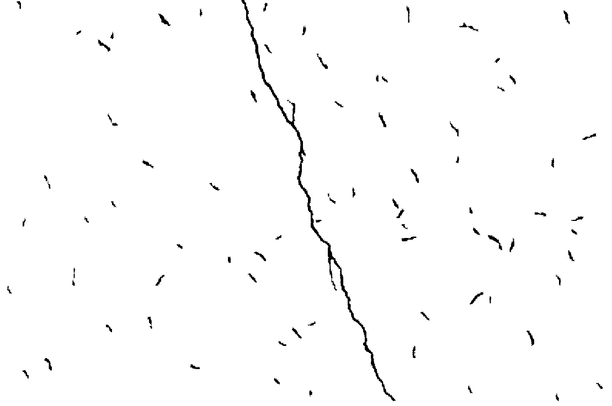
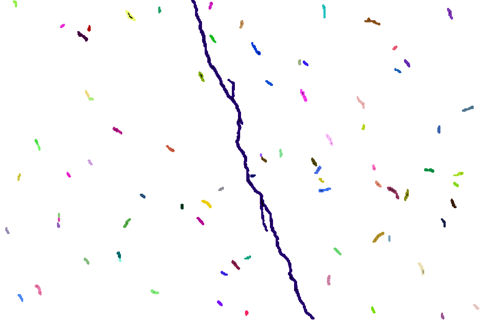
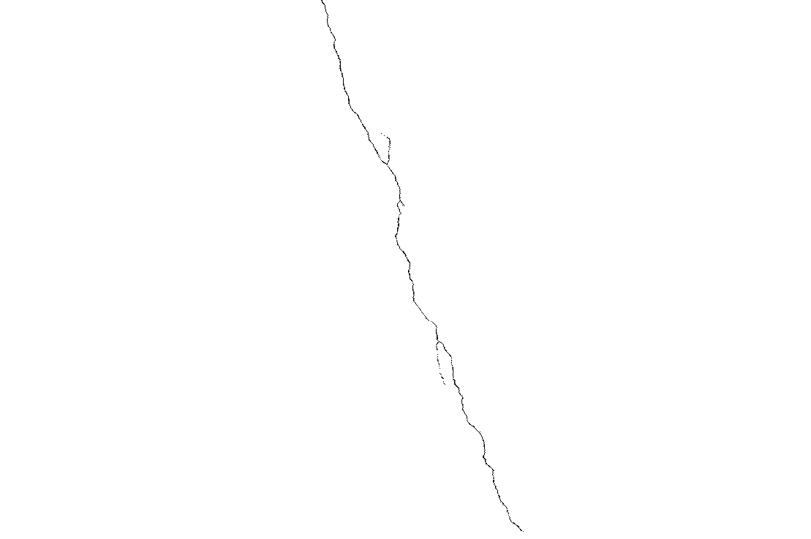
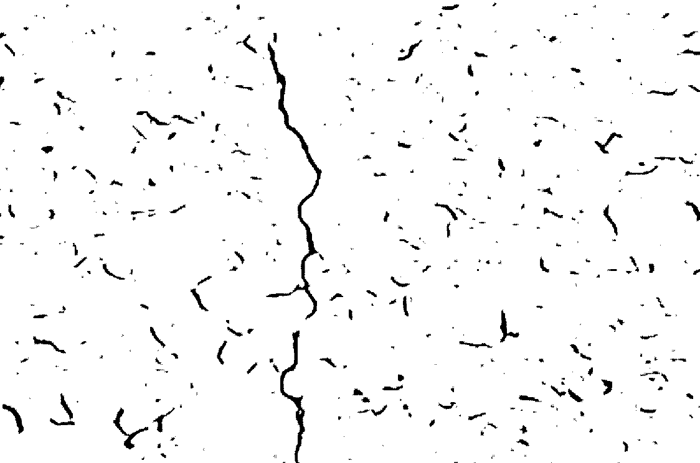
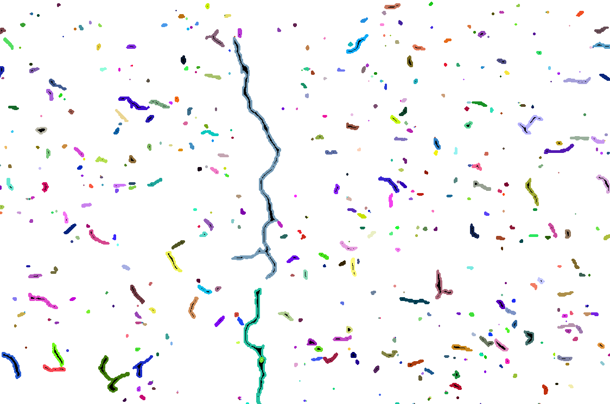
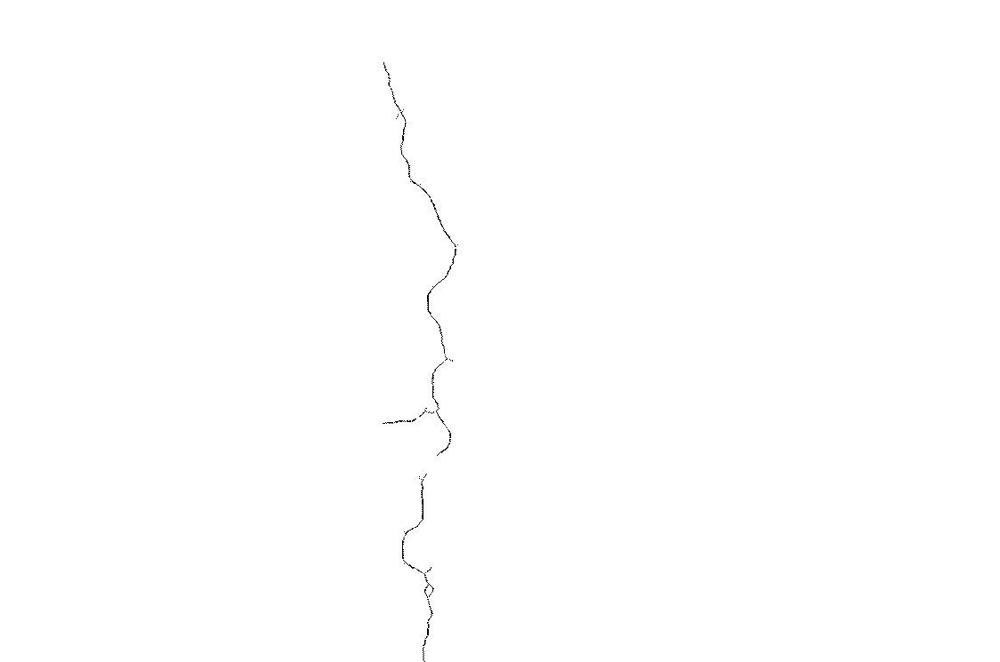

PS5-1Binary image processing – detecting blobs, contours, and central axes

Shaobo Wang


Screenshots of all the files in the “ps4-1” folder:


Terminal commands:

```
>> python ps5_1.py wall1.png
>> python ps5_1.py wall2.png
```


Output images:

wall1-blobs



wall1-contours



wall1-cracks



wall2-blobs



wall2-contours



wall2-cracks



Notes:

The threshold used to detect cracks is based on the maximum contour area among all cracks. 
$$
thr = Area_{\max}\times40\%
$$
This means all the contours whose areas are larger than 40% of the max area will be counted as a real crack. 


Source code:

Operating system: Windows 10
IDE: PyCharm

```python
import cv2
import sys
import numpy as np

win_original_name = "Original Image"
win_blobs_name = "Clean blobs Image"
win_contours_name = "Blobs contours Image"
win_cracks_name = "Thin crack Image"


# insert string before
def insert_name(name, str2add):
    dot_idx = name.find(".")
    new_name = name[:dot_idx] + str2add + name[dot_idx:]
    return new_name


# closing to connect parts
def closing(img_in):
    kernel = cv2.getStructuringElement(cv2.MORPH_CROSS, (3, 3))
    img_temp = cv2.erode(img_in, kernel)
    img_out = cv2.dilate(img_temp, kernel)
    return img_out


# find contour for each parts
def contour(img_in):
    img_out = img_in.copy()
    img_in = cv2.cvtColor(img_in, cv2.COLOR_BGR2GRAY)
    img_nin = cv2.bitwise_not(img_in)
    cnt, hr = cv2.findContours(img_nin, cv2.RETR_TREE, cv2.CHAIN_APPROX_SIMPLE)

    for i in range(len(cnt)):
        color = (np.random.randint(low=0, high=255),  # random color
                 np.random.randint(low=0, high=255),
                 np.random.randint(low=0, high=255))
        cv2.drawContours(img_out, cnt, i, color, 2, hierarchy=hr)
    return img_out, cnt, hr


# find largest cracks with thinning
def cracks(img_in, cnt, hr):
    # find largest cracks
    area = np.empty(len(cnt))  # calculate area
    for i in range(len(cnt)):
        area[i] = cv2.contourArea(cnt[i])
    thr = np.max(area)*0.4  # threshold be
    idx = np.nonzero(area > thr)[0]  # index of area larger than threshold

    img_ck = np.zeros(np.shape(cv2.cvtColor(img_in, cv2.COLOR_BGR2GRAY)), dtype=np.uint8)
    for i in range(np.size(idx)):
        cv2.drawContours(img_ck, cont, idx[i], 255, thickness=-1, hierarchy=hr)

    # thinning
    kernel = cv2.getStructuringElement(cv2.MORPH_CROSS, (3, 3))
    thin = np.zeros(np.shape(cv2.cvtColor(img_in, cv2.COLOR_BGR2GRAY)), dtype=np.uint8)

    while cv2.countNonZero(img_ck) != 0:
        er = cv2.erode(img_ck, kernel)
        op = cv2.morphologyEx(er, cv2.MORPH_OPEN, kernel)
        subset = er - op
        thin = cv2.bitwise_or(subset, thin)
        img_ck = er.copy()

    img_out = cv2.bitwise_not(thin)
    return img_out


if __name__ == "__main__":
    # get input arguments
    args = sys.argv
    assert (len(args) == 2)  # make sure two arguments input
    img_name = args[1]  # input image path

    # '''
    # debug use
    # '''
    # img_name = "wall2.png"
    # '''
    # '''

    cv2.namedWindow(win_original_name)
    cv2.namedWindow(win_blobs_name)
    cv2.namedWindow(win_contours_name)
    cv2.namedWindow(win_cracks_name)

    # read original image
    img = cv2.imread(img_name)
    if img is None:
        sys.exit("Could not read the image.")
    cv2.imshow(win_original_name, img)
	
    # step(1)
    img_blobs = closing(img)
    cv2.imshow(win_blobs_name, img_blobs)
	
    # step(2)
    img_cont, cont, hier = contour(img_blobs)
    cv2.imshow(win_contours_name, img_cont)
	
    # step(3)& step(4)
    img_cracks = cracks(img, cont, hier)
    cv2.imshow(win_cracks_name, img_cracks)
    
    print("Press 'S' to save and exit")
    key = cv2.waitKey(-1)

    if key == ord("s"):
        #  press 'S' to save
        img_blobs_name = insert_name(img_name, "-blobs")
        cv2.imwrite(img_blobs_name, img_blobs)
        img_cont_name = insert_name(img_name, "-contours")
        cv2.imwrite(img_cont_name, img_cont)
        img_cracks_name = insert_name(img_name, "-cracks")
        cv2.imwrite(img_cracks_name, img_cracks)
        cv2.destroyAllWindows()

    elif key == ord("q") or key == ord("x") or key == 27:
        # press 'q', 'x', 'ESC' to quit
        cv2.destroyAllWindows()

```